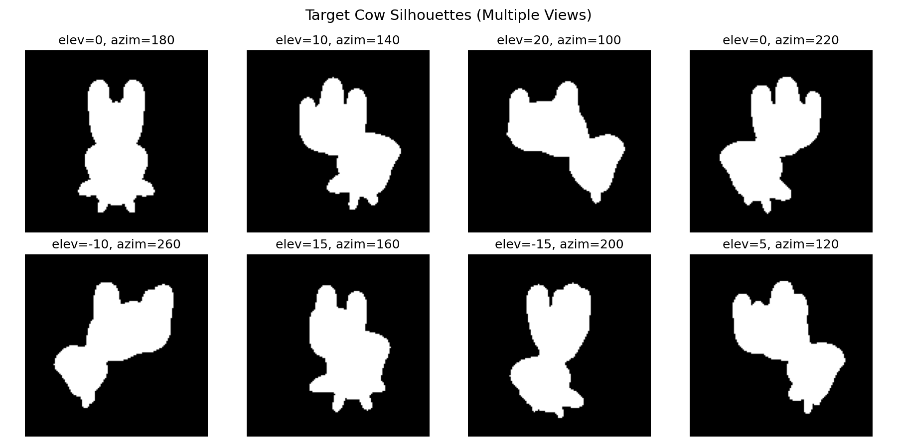
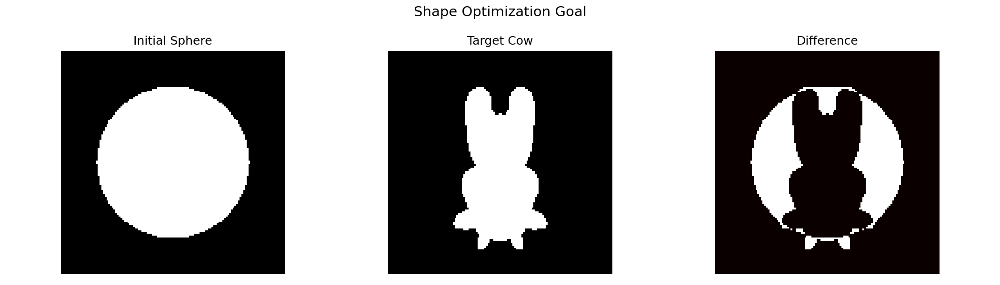
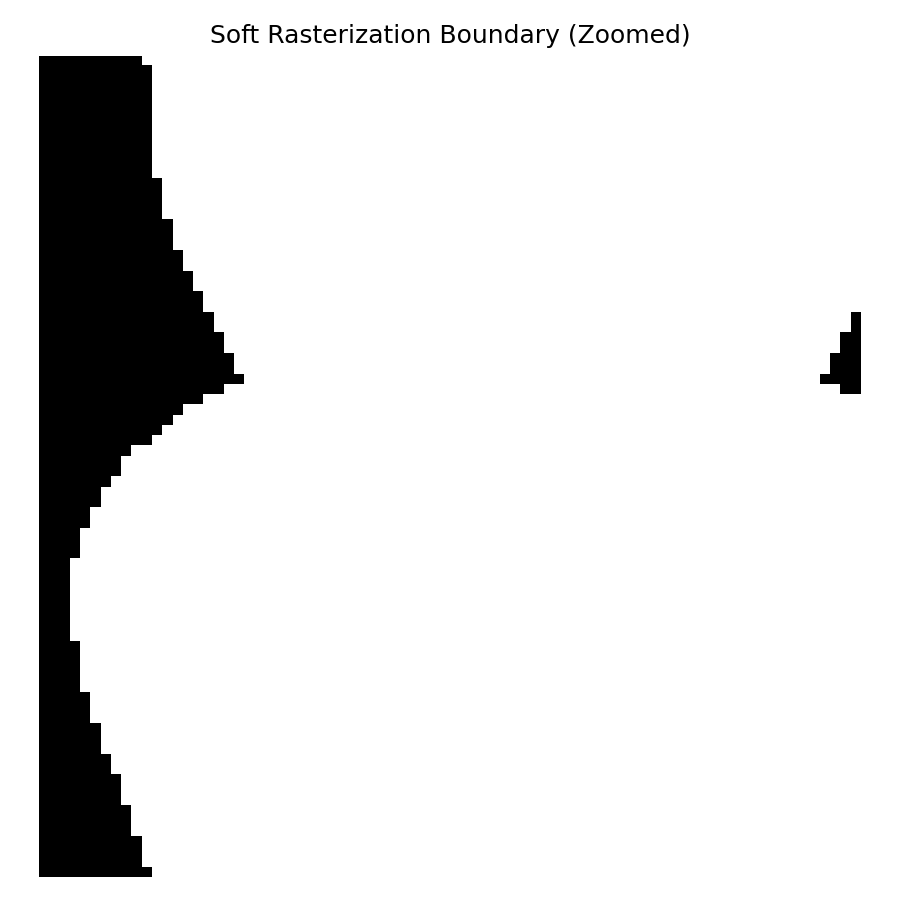
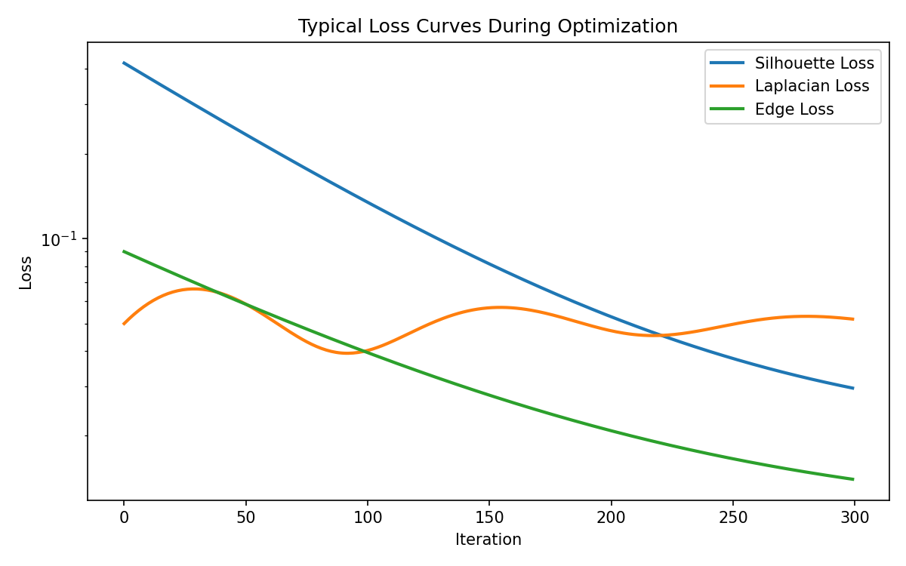

# Work5: 可微光栅化与网格优化

## 实验目标

理解并掌握可微光栅化（Soft Rasterization）的原理，特别是处理离散几何体（Mesh）边界时的数学近似方法。通过多视角二维剪影反推并优化三维空间中的网格顶点坐标，将一个初始的"球体"通过梯度下降逐渐"捏"成一头"奶牛"的形状。

## 核心原理

### 1. 软光栅化（Soft Rasterization）

传统硬光栅化中，像素要么在三角形内，要么在外，导致边界处梯度为0（梯度消失）。本实验使用软光栅化，通过计算像素到三角形边缘的距离，利用 Sigmoid 函数在边界处产生平滑的概率过渡：

$$A(d) = \text{sigmoid}\left(\frac{d}{\sigma}\right)$$

其中 $\sigma$ 控制边缘的模糊程度，使得即使顶点在像素外部也能提供微小但非零的梯度。

### 2. 网格正则化（Mesh Regularization）

为了防止网格在优化过程中交叉、重叠、陷入局部最优，引入三种正则化损失：

- **拉普拉斯平滑 (Laplacian Smoothing)**：约束相邻顶点，防止表面出现尖锐突起
- **边长一致性 (Edge Length Penalty)**：惩罚过长或过短的边，防止三角形严重拉伸
- **法线一致性 (Normal Consistency)**：约束相邻三角形面的法线方向接近，保持表面平滑

总损失函数：

$$L_{total} = L_{silhouette} + w_{lap}L_{lap} + w_{edge}L_{edge} + w_{normal}L_{normal}$$

## 项目结构

```
Work5/
├── data/
│   └── cow_mesh/           # 目标奶牛模型（OBJ格式）
│       ├── cow.obj
│       ├── cow.mtl
│       └── cow_texture.png
├── images/                 # README 展示图片
│   ├── target_silhouettes.png
│   ├── sphere_vs_cow.png
│   ├── soft_boundary.png
│   └── loss_curve_demo.png
├── output/                 # 优化结果输出目录
├── mesh_utils.py           # 网格工具：OBJ加载、球体生成、邻接信息
├── renderer.py             # 纯PyTorch软光栅化渲染器
├── losses.py               # 三种网格正则化损失 + 剪影MSE损失
├── main.py                 # 主程序：加载、渲染、优化、可视化
├── gen_readme_images.py    # 生成README展示图片的脚本
├── test_basic.py           # 基础功能测试
└── README.md               # 本文件
```

## 环境配置

由于 Windows 环境下 pytorch3d 安装较为复杂（需要 Visual C++ 编译器），本项目采用**纯 PyTorch 实现**软光栅化渲染管线，无需安装 pytorch3d。

### 所需依赖

```bash
pip install torch torchvision numpy matplotlib imageio tqdm
```

或使用 conda：

```bash
conda create -n graphics python=3.10
conda activate graphics
pip install torch torchvision numpy matplotlib imageio tqdm
```

## 运行方法

### 快速运行（默认参数，适合CPU快速验证）

```bash
python main.py
```

默认参数：
- 图像尺寸：64x64
- 视角数量：12个
- 优化轮数：300轮
- 初始球体：细分2次（320个面）

### 自定义参数

```bash
python main.py \
    --image_size 128 \
    --num_views 20 \
    --num_iters 1000 \
    --lr 0.01 \
    --w_lap 0.2 \
    --w_edge 0.1 \
    --w_normal 0.01 \
    --sphere_level 3 \
    --output_dir ./output
```

### 参数说明

| 参数 | 默认值 | 说明 |
|------|--------|------|
| `--image_size` | 64 | 渲染图像分辨率 |
| `--num_views` | 12 | 多视角相机数量 |
| `--num_iters` | 300 | 优化迭代次数 |
| `--lr` | 0.01 | Adam优化器学习率 |
| `--w_lap` | 0.2 | 拉普拉斯平滑权重 |
| `--w_edge` | 0.1 | 边长一致性权重 |
| `--w_normal` | 0.01 | 法线一致性权重 |
| `--sigma` | 1e-4 | 软光栅化边缘模糊参数 |
| `--sphere_level` | 2 | 初始球体细分等级（2=320面, 3=1280面）|

## 效果展示

### 多视角目标剪影

程序首先在空间中均匀设置多个摄像机视角，渲染出奶牛的目标剪影图作为优化的 Ground Truth：



### 优化目标：从球体到奶牛

初始状态为一个细分后的球体网格，优化目标是通过梯度下降使球体的多视角剪影逐渐逼近奶牛的剪影：



### 软光栅化边界效果

软光栅化通过 Sigmoid 函数在三角形边界处产生平滑过渡，避免了传统硬光栅化在边界处的梯度消失问题。下图展示了渲染边界的局部放大：



### 损失曲线

优化过程中，剪影损失逐渐下降，同时正则化项保证网格不会崩坏：



## 输出结果

运行后会在 `output/` 目录下生成：

- `target_silhouettes.png`：多视角目标剪影参考
- `mesh_iter_XXXX.obj`：各阶段的网格模型（可在Blender/MeshLab中查看）
- `compare_iter_XXXX.png`：预测 vs 目标 vs 差异的对比图
- `optimization_process.gif`：优化过程动画
- `loss_curve.png`：各损失分量的收敛曲线
- `final_mesh.obj`：最终优化得到的网格

## 代码实现要点

### 软光栅化渲染器 (`renderer.py`)

实现了基于 Sigmoid 的软光栅化：
1. 将顶点通过 look-at 相机变换和透视投影映射到 NDC 空间
2. 对每个三角形，计算其屏幕空间包围盒
3. 在包围盒内对每个像素计算到三条边的有符号距离
4. 使用 Sigmoid 将距离映射为覆盖概率：`coverage = sigmoid(d0/σ) * sigmoid(d1/σ) * sigmoid(d2/σ)`
5. 使用 soft z-buffer 聚合多个三角形的贡献，处理遮挡关系

### 网格正则化 (`losses.py`)

- **拉普拉斯平滑**：利用预计算的邻接信息，向量化计算每个顶点与其邻居均值的偏差
- **边长损失**：计算所有边的长度与目标长度的均方误差
- **法线一致性**：利用预计算的相邻面对，向量化计算相邻面法线的余弦距离

### 优化流程 (`main.py`)

1. 加载并归一化目标奶牛网格
2. 生成围绕物体的多视角相机（均匀分布的方位角和仰角）
3. 预渲染目标剪影作为 ground truth
4. 初始化可微分的顶点偏移量 `deform_verts`
5. 使用 Adam 优化器迭代更新顶点位置
6. 每若干轮保存中间结果用于可视化

## 注意事项

1. **运行时间**：纯 Python/PyTorch 实现的软光栅化在 CPU 上运行较慢，建议使用 GPU（设置 `--device cuda`）以加速渲染和优化。
2. **初始网格**：球体的细分等级越高（面数越多），优化效果越精细，但计算开销越大。
3. **正则化权重**：权重过小会导致网格崩坏（出现尖刺、自交），权重过大会抑制形状拟合，需要根据实验调整。

## 实验拓展（选做）

可在此基础上加入 RGB 纹理渲染，不仅拟合剪影，还拟合 RGB 图像，同时优化网格的顶点坐标和顶点颜色。
