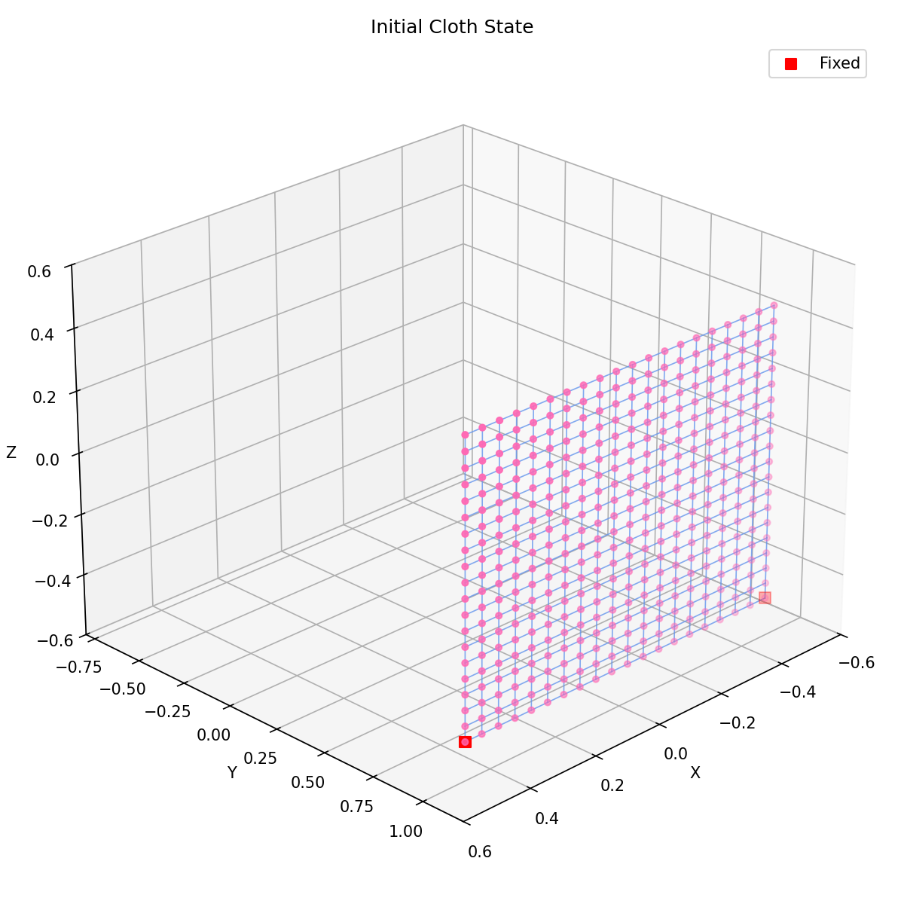
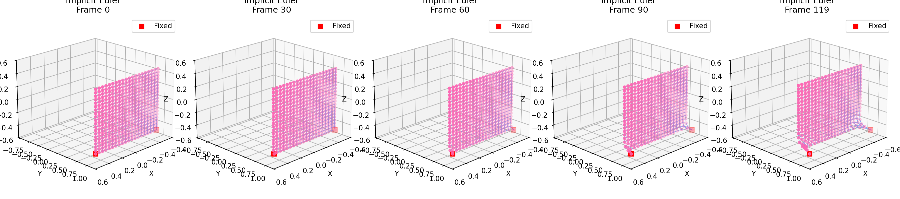
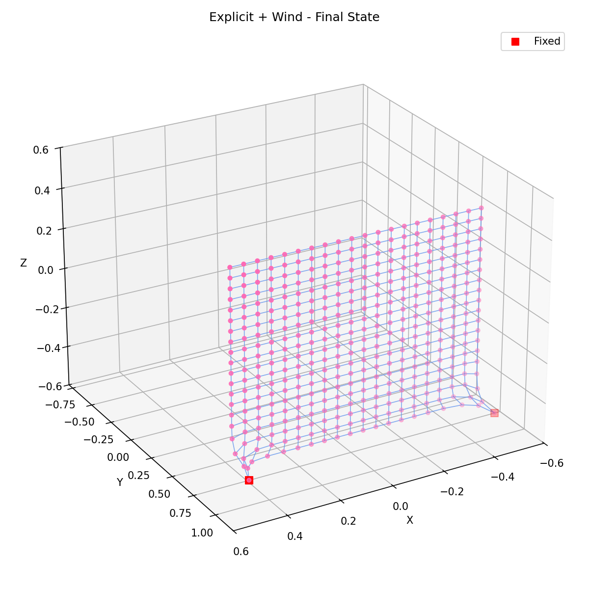

# Work6: 质点-弹簧布料模拟与数值积分对比

## 实验目标

- 掌握动态场景渲染：使用 Taichi 框架构建 3D 场景，学习使用 Taichi GGUI 编写交互面板。
- 理解质点-弹簧模型：掌握基于物理的弹力与阻尼力计算方法，并处理数值爆炸问题（速度钳制）。
- 对比数值积分方法：独立编写并比较三种常见的数值积分求解器（显式欧拉、半隐式欧拉、隐式欧拉），观察并理解它们在物理模拟中的稳定性差异。
- 理解 GPU 编程基础：学习 Taichi 中的 `ti.kernel` 与 `ti.func`，了解并行计算中的状态同步与 Kernel 启动开销优化。

## 项目结构

```
Work6/
├── main.py              # 主程序：完整物理模拟 + GGUI 交互
├── test_simulation.py   # 无头测试脚本：批量生成对比截图
├── images/              # 模拟结果截图
│   ├── initial_state.png
│   ├── explicit_sequence.png
│   ├── explicit_wind_final.png
│   ├── semi_implicit_sequence.png
│   ├── implicit_sequence.png
│   └── ...
└── README.md            # 本文件
```

## 环境配置

```bash
pip install taichi numpy matplotlib
```

或使用 conda：

```bash
conda create -n graphics python=3.10
conda activate graphics
pip install taichi numpy matplotlib
```

## 运行方法

### 交互式版本（需要图形界面）

```bash
python main.py
```

- 鼠标右键拖拽：旋转视角
- 按钮 1/2/3：切换三种积分方法
- Pause / Resume：暂停/继续
- Reset Cloth：重置布料
- 方向键：施加大风
- R 键：重置
- Space 键：暂停/继续

### 无头测试版本（生成截图）

```bash
python test_simulation.py
```

会在 `images/` 目录下生成多张对比图。

## 效果展示

### 初始状态

20x20 的布料网格，第一行左右两角固定：



### 三种积分方法对比（无风）

在相同参数下运行 120 帧的对比：

**显式欧拉 (Explicit Euler)**：


**半隐式欧拉 (Semi-Implicit Euler)**：


**隐式欧拉 (Implicit Euler)**：



### 风力效果（显式欧拉）

施加风力后布料被吹起的动态效果：



## 核心实现要点

### 1. 质点-弹簧模型

根据胡克定律计算弹簧力：

$$f_{a} = -k_{s} (|x_a - x_b| - l) \frac{x_a - x_b}{|x_a - x_b|}$$

同时引入阻尼力防止能量无限增加：

$$f_{d} = -k_{d} v_{a}$$

### 2. 数值积分方法

- **显式欧拉**：完全使用当前时刻状态预测下一时刻，简单但稳定性差
- **半隐式欧拉**：先更新速度，再用新速度更新位置，稳定性优于显式
- **隐式欧拉**：使用定点迭代近似求解隐式方程，稳定性最好但计算量大

### 3. GPU 并行优化

- 使用 `@ti.kernel` 定义 GPU 并行入口
- 使用 `@ti.func` 内联计算函数（`compute_forces`、`clamp_velocity`），减少函数调用开销
- 将受力计算和积分更新合并到同一个 Kernel 中，最小化每帧 Kernel 启动次数
- 使用 `ti.atomic_add` 处理多线程写入冲突

### 4. 防爆处理

`clamp_velocity()` 函数限制质点最大速度，防止在显式欧拉等不稳定方法中出现严重的数值爆炸。

## 注意事项

1. **GGUI 需要图形界面**：`main.py` 使用 Taichi GGUI，在无头服务器上无法运行。请使用 `test_simulation.py` 在无头环境中测试。
2. **性能**：默认使用 `ti.cpu`，本地有支持 Vulkan 的显卡时可改为 `ti.gpu`。
3. **稳定性**：显式欧拉在大时间步长下容易发散，建议减小 `dt` 或切换为半隐式/隐式欧拉。

## 实验拓展

可在此基础上增加：
- 剪切弹簧和对角弹簧，模拟更真实的布料拉伸和剪切行为
- 碰撞检测：布料与球体/平面的碰撞响应
- 更多积分方法：Verlet、Runge-Kutta 等
